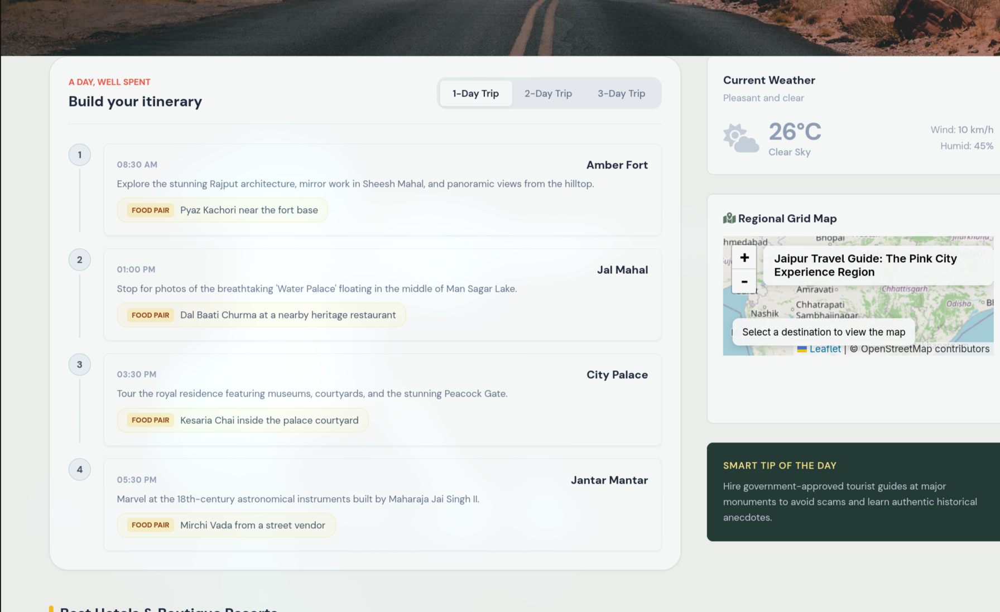
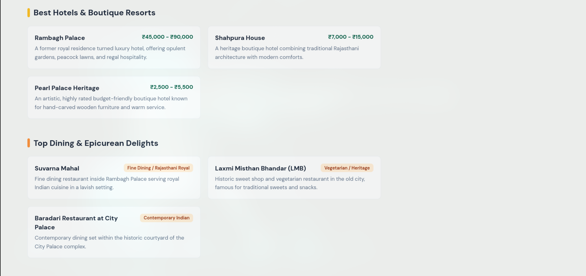
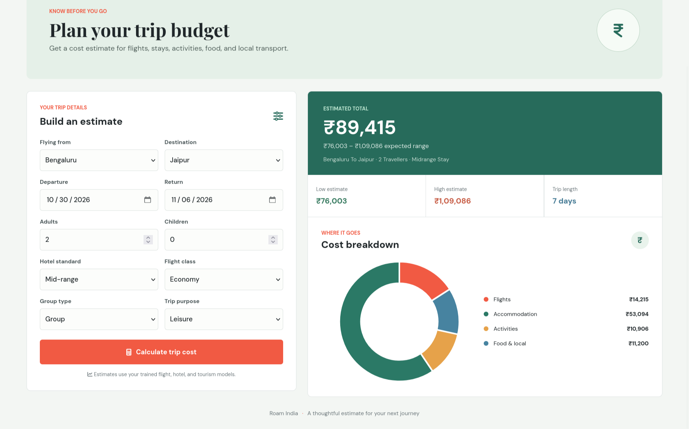

# RoamIndia

**AI-powered trip planning and machine-learning travel cost estimates for trips across India.**

RoamIndia brings destination discovery, itinerary generation, hotel and attraction suggestions, interactive maps, and a trained expense estimator together in one travel-planning workspace.

<p align="center">
  
</p>

## Product Screenshots

### Destination search and travel guide

Search an Indian destination to generate a local guide with current weather, suggested stays, dining, attractions, hidden gems, and multi-day itinerary options.

<p align="center">
  
</p>

### Itinerary and interactive map

Review timed itinerary stops alongside the weather summary, destination map, and practical local tips.

<p align="center">
  
</p>

### Hotel and dining recommendations

Browse destination-specific recommendations with Indian rupee price estimates for accommodation.

<p align="center">
  
</p>

### Expense calculator

Estimate a trip budget by route, dates, traveler count, hotel tier, flight class, group type, and trip purpose. View the estimated range, trip statistics, and cost-breakdown chart.

<p align="center">
  
</p>

## Features

- **AI travel guides:** Generate destination overviews and recommendations with Gemini. Static fallback guides remain available when Gemini cannot be reached.
- **Trip itineraries:** Explore one-, two-, and three-day plans with suggested times, stops, descriptions, and local food pairings.
- **Interactive destination map:** View the destination in the project’s Leaflet map with OpenStreetMap tiles.
- **Weather context:** Show live weather when an OpenWeatherMap key is configured.
- **Machine-learning expense estimates:** Combine flight, hotel, and tourism models with food and local-transport estimates.
- **Cost visualization:** Compare flights, accommodation, activities, and food/local costs in an interactive doughnut chart.
- **Live hotel listings:** Optionally query Google Hotels through SerpAPI. This is separate from the trained hotel cost estimate.
- **Streamlit application:** Provides the integrated predictor, travel guide, itinerary, map, and travel assistant tabs.
- **Standalone planner:** Flask serves a destination guide at `/planner` and the expense calculator at `/calculator`.

## Technology

- Python, Streamlit, and Flask
- Google Gemini API for travel-guide generation
- XGBoost flight and hotel regressors
- Gradient-boosted tourism cost model
- Plotly charts
- Leaflet and OpenStreetMap
- OpenWeatherMap and SerpAPI integrations (optional)

## Project Structure

```text
roam india/
├── aggregator/          # Combines the trained cost estimates
├── components/          # Leaflet map HTML component
├── data/                # Local training data location; datasets are not committed
├── docs/                # Setup and integration notes
├── flight_model/        # Flight model training and prediction
├── hotel_model/         # Hotel model training and prediction
├── images/              # Product screenshots used in this README
├── models/              # Trained model artifacts used by the app
├── tourism_model/       # Tourism model training and prediction
├── trip planner/        # Flask planner, calculator, and frontend assets
├── app.py               # Integrated Streamlit app
├── gemini_guide.py      # Gemini guide generation and fallback guide
├── map_component.py     # Streamlit Leaflet embedding
├── map_utils.py         # Map coordinates, markers, and links
├── requirements.txt
└── .env.example
```

## Getting Started

### 1. Create an environment and install dependencies

From the repository root:

```bash
python -m venv .venv
```

Activate it, then install the project requirements:

```bash
# Linux or macOS
source .venv/bin/activate

# Windows PowerShell
.\.venv\Scripts\Activate.ps1

pip install -r requirements.txt
```

### 2. Configure API keys

Copy `.env.example` to `trip planner/.env` and fill in the keys you have. The local `.env` is ignored by Git and must never be committed.

```bash
cp .env.example "trip planner/.env"
```

Required for Gemini-generated guides:

```env
GEMINI_API_KEY=your_gemini_api_key
```

Optional integrations:

```env
WEATHER_API_KEY=your_openweathermap_api_key
SERPAPI_API_KEY=your_serpapi_api_key
```

Without a Gemini key or while Gemini is unavailable, the guide endpoint uses its built-in fallback content. Live weather and live hotel listings require their respective keys.

### 3. Start an application

Run the integrated Streamlit app:

```bash
streamlit run app.py
```

Or start the standalone Flask planner and calculator:

```bash
cd "trip planner"
python app.py
```

Then open:

- Planner: <http://127.0.0.1:5000/planner>
- Expense calculator: <http://127.0.0.1:5000/calculator>

The Flask app exposes `/api/explore` for travel guides and `/api/estimate` for model-based trip estimates. Keep the Flask server running while using these pages.

## Expense Estimate Details

The cost aggregator combines four components:

1. **Flights:** Estimated from origin, destination, departure date, traveler count, and seat class.
2. **Accommodation:** Estimated from destination, hotel tier, check-in/check-out dates, and traveler details. Seasonal adjustments are applied by the hotel predictor.
3. **Activities:** Estimated from destination, trip duration, group type, purpose, hotel tier, and travel season.
4. **Food and local transport:** Calculated using a daily rate based on the selected hotel tier and trip length.

The displayed low, midpoint, and high values are model estimates, not guaranteed prices. Live provider listings and availability may change.

## Model Artifacts and Training Data

The trained artifacts required for inference are included in `models/`. The original datasets and generated processing/EDA files are intentionally excluded from Git because of size and source/licensing considerations. Place authorized source data under `data/raw/` locally before running training scripts.

Training scripts are organized under `flight_model/`, `hotel_model/`, and `tourism_model/`. Some model artifacts are Python serialization files; load them only from a trusted source and compatible Python/library environment.

## Security and Configuration

- Never commit `trip planner/.env`, API tokens, user records, or credentials.
- `.gitignore` excludes local environment files, virtual environments, caches, and datasets.
- `.env.example` contains placeholders only; replace values in your local `.env` file.
- Revoke and rotate any API key that has previously been committed or shared publicly.

## Notes

- Gemini and live data providers require network access and may enforce quotas or rate limits.
- The expense models can run without Gemini, weather, or SerpAPI credentials, provided their trained artifacts are present.
- Refer to [`docs/QUICKSTART.md`](docs/QUICKSTART.md) and [`docs/INTEGRATION_GUIDE.md`](docs/INTEGRATION_GUIDE.md) for additional project notes.
